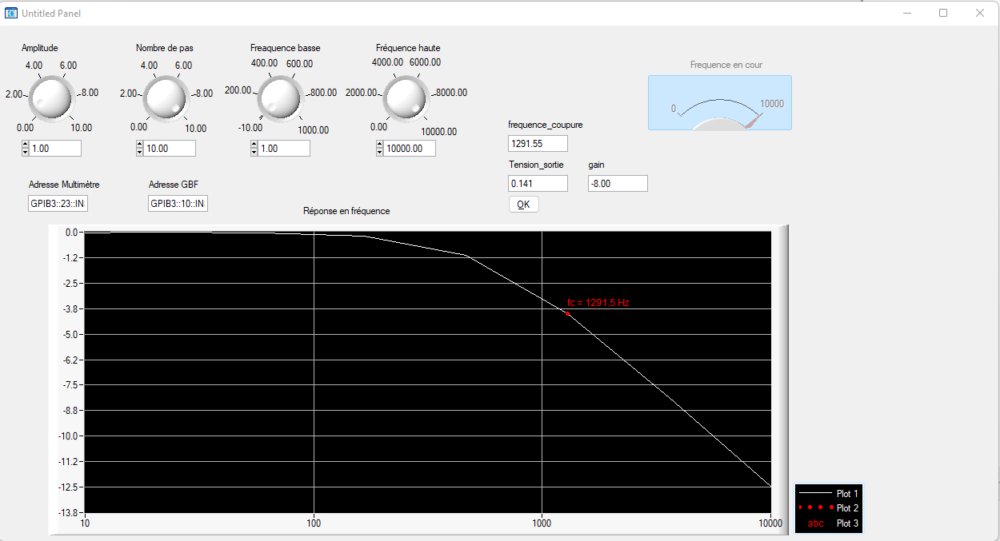
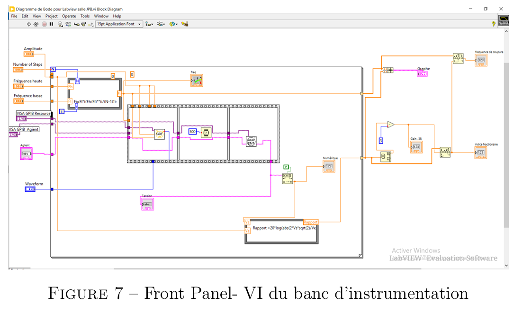
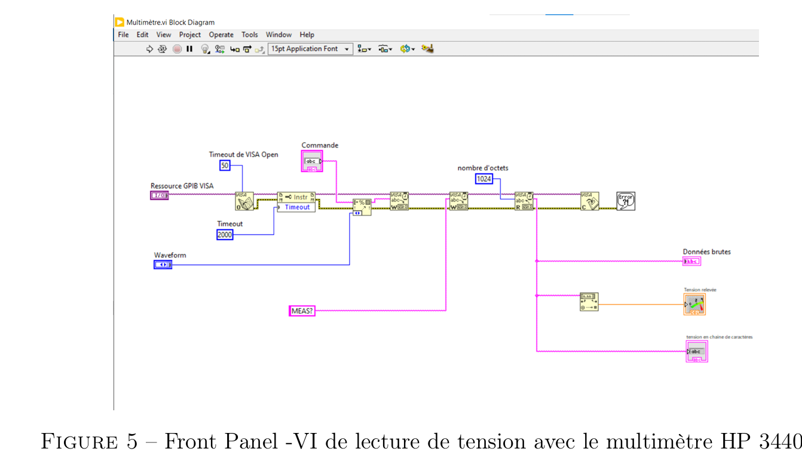
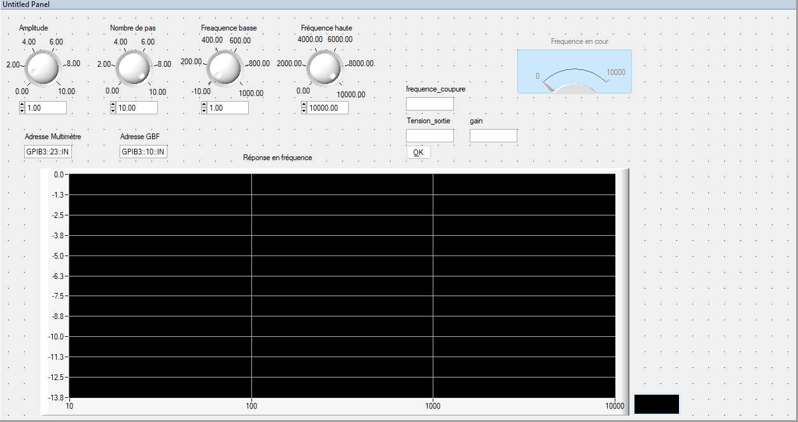
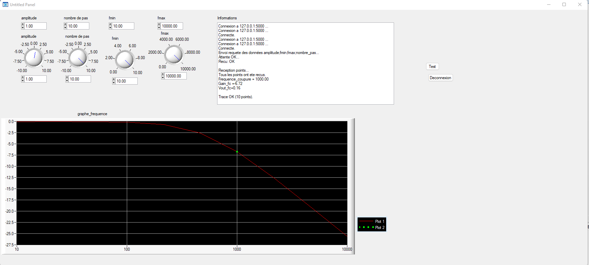
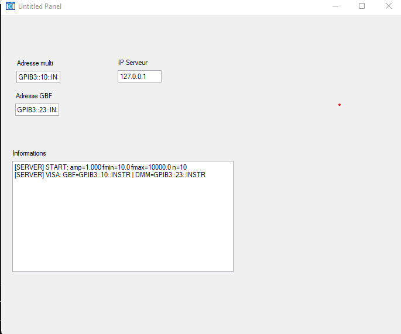

# Automated Instrumentation Platform

Academic instrumentation project developed at **ENSIM – Le Mans University**.

This repository presents two successive implementations of an automated measurement platform used to characterize the frequency response of electronic circuits:

- a first implementation in **LabVIEW**;
- a second implementation in **LabWindows/CVI (ANSI C)**, including both a local and a distributed **client-server** version.

The platform automates the control of laboratory instruments, performs a frequency sweep, acquires output measurements, computes the gain, and plots the corresponding **Bode magnitude response**.

---

## Preview



---

## Project overview

The objective of the project is to automate the experimental analysis of analog circuits, especially first-order filters, by controlling:

- a **function generator (GBF)**;
- a **digital multimeter**;
- a test circuit mounted on a breadboard.

The system performs an automatic sweep over a frequency range, measures the output voltage, computes the gain in dB, and estimates the **cutoff frequency**.

This work was developed in two stages:

### Generation 1 — LabVIEW implementation
The first version focuses on instrument automation and Bode diagram generation using **LabVIEW** and **VISA/GPIB** communication.

### Generation 2 — LabWindows/CVI implementation
The second version reimplements the measurement bench in **C with LabWindows/CVI**, first as a local application and then as a **distributed client-server architecture over TCP/IP**.

---

## Main features

- Automated control of a **function generator**
- Automated acquisition from a **digital multimeter**
- Configurable **amplitude**, **number of steps**, **minimum frequency**, and **maximum frequency**
- Automatic **frequency sweep**
- Computation of **gain in dB**
- Plotting of the **frequency response**
- Estimation of the **cutoff frequency**
- Instrument supervision through a **graphical interface**
- Distributed measurement workflow with **TCP/IP communication** in the LabWindows/CVI version

---

## Hardware setup

The experimental bench is based on a simple analog circuit under test and two programmable instruments.

### Instruments
- Agilent / Keysight function generator
- Agilent / Keysight digital multimeter
- Breadboard test circuit
- GPIB communication interfaces

### Example bench setup


### Example RC filter under test


---

## Software implementations

## 1. LabVIEW version

The first implementation was developed in **LabVIEW** and automates the measurement process through **VISA/GPIB** communication.

### LabVIEW capabilities
- frequency sweep generation;
- instrument control;
- voltage acquisition;
- gain calculation;
- Bode magnitude plotting;
- cutoff-frequency estimation.

### Main LabVIEW VI



### Multimeter acquisition VI



---

## 2. LabWindows/CVI version

The second implementation was developed in **ANSI C with LabWindows/CVI**.

It includes two approaches:

### Local version
A direct application that controls instruments locally and plots the measured response.



### Client-server version
A distributed version in which:
- the **server** handles the instruments through **VISA/GPIB**;
- the **client** sends measurement parameters, receives measurement points, and displays the resulting graph.

#### Client interface



#### Server log



---

## System architecture

### LabVIEW architecture
- instrument automation through VISA/GPIB;
- single-application measurement workflow;
- local visualization and computation.

### LabWindows/CVI architecture
- **direct/local version** for local control and plotting;
- **client-server version** for distributed measurement handling;
- separation between:
  - measurement execution,
  - communication,
  - visualization,
  - and result supervision.

---

## Measurement workflow

1. The user configures:
   - input amplitude,
   - number of frequency steps,
   - minimum frequency,
   - maximum frequency.

2. The function generator applies the excitation signal.

3. The multimeter reads the output voltage of the circuit.

4. The software computes the gain for each frequency.

5. The full response is plotted on a logarithmic frequency scale.

6. The cutoff frequency is estimated from the measured response.

---

## Validation strategy

The project was validated incrementally.

### Step 1 — Instrument communication
- validation of GPIB communication;
- instrument addressing;
- command transmission and response reading.

### Step 2 — Automated acquisition
- stable voltage measurement;
- repeatable sweep execution;
- correct parameter transfer.

### Step 3 — Data processing
- gain computation in dB;
- Bode plot generation;
- cutoff-frequency estimation.

### Step 4 — Distributed execution
- TCP/IP connection setup;
- request/response exchange between client and server;
- reception and plotting of all measurement points.

---

## Example results

The platform successfully produced an automated Bode magnitude response and estimated the cutoff frequency of the tested circuit.

Example observed outputs:
- automatic reception of measurement points;
- gain computation at cutoff;
- automatic trace generation;
- display of the estimated cutoff frequency.

---

## Repository structure

```text
automated-instrumentation-platform/
+-- README.md
+-- assets/
¦   +-- images/
¦       +-- hero-labwindows-bode.png
¦       +-- hardware-bench.jpg
¦       +-- hardware-rc-filter.jpg
¦       +-- labview-main-vi.png
¦       +-- labview-multimeter-vi.png
¦       +-- cvi-local-ui.png
¦       +-- cvi-client-ui.png
¦       +-- cvi-server-log.png
¦
+-- docs/
¦   +-- labview-report.pdf
¦   +-- labwindows-cvi-report.pdf
¦
+-- src/
    +-- labview/
    +-- labwindows-cvi/
```
## Technologies used
Languages and environments
- LabVIEW
- ANSI C
- LabWindows/CVI
## Communication and instrumentation
- VISA
- GPIB
- SCPI
- TCP/IP
## Experimental context
- analog circuit characterization
- automated measurement
- Bode diagram generation
- instrumentation supervision
## Academic context
This repository reflects an academic project carried out at ENSIM – Le Mans University in the context of instrumentation, embedded/software experimentation, and automated laboratory measurements.
It illustrates a progression from:
- graphical instrumentation development in LabVIEW,
  to
- software engineering and distributed instrumentation in LabWindows/CVI.
## Authors
- Michael Essomba
- collaborators depending on project phase / academic year
## Possible improvements
- cleaner modularization of the codebase;
- export of measurement data to CSV;
- phase measurement in addition to magnitude response;
- improved error handling;
- richer client-server supervision;
- clearer separation between acquisition, processing, and visualization modules.